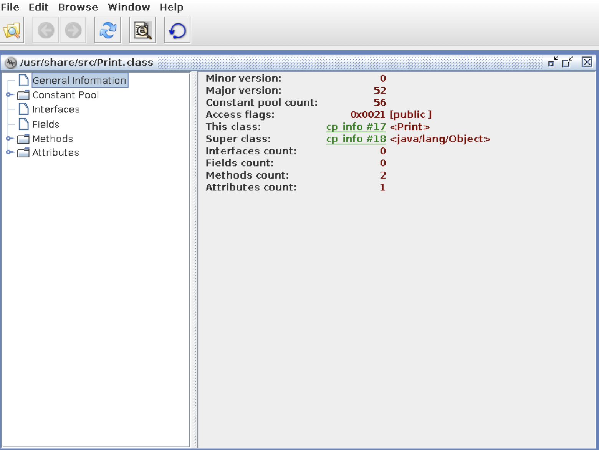

# CMPSC 101 Participation

## Introduction

This class activity invites individuals to examine the output of the Java compiler.


### VNC Viewer Setup

Download and install VNC Viewer.

- [Mac VNC Viewer](https:/www.realvnc.com/en/connect/download/viewer/macos/)
- [Windows VNC Viewer](https:/www.realvnc.com/en/connect/download/viewer/windows/)
- [Ubuntu VNC Viewer](https:/www.realvnc.com/en/connect/download/viewer/linux/)

### Loading Docker Container

The following steps assume that you have Docker Desktop installed. If your set up has
been done correctly, you should be able to get started and validate the Docker
version and run the hello world docker container using the following commands:
`docker –version`
`docker run hello-world`

1. Navigate to the `activity1` directory inside your "class_activities" repository.

2. Provide the executable privilege to the `entrypoint.sh` file by running the following command:

`chmod +x entrypoint.sh`

3. Build the docker image using the following command:

`docker build -t jbe .`

 Note: in this command, jbe is the user provided container name, which could be any name but in this
 activity we will use "jbe" for consistency. Additionally, you need to be inside the `activity1` directory in order to run the build command.

4. Upon successful build, you can verify the correctness of image creation by running the following command:

`docker image ls`

The image named "jbe" should be listed as one of the images in the output.

5. Run docker container based on the image created in the previous steps using the following command:

```
docker run -t -d -P -v /Users/janyljumadinova/Documents/repos/2020-2021/cs201/class_activities/activity1/src:/usr/share/src --rm -ti -p 5900:5900 --name jbe01 jbe
```

Note: In the command above, replace the directory path "/Users/janyljumadinova/Documents/repos/2020-2021/cs201/class_activities/activity1/myimages/src" with the path of the directory to your class activities repository in YOUR machine.

If you have a Windows machine and the above command does not execute correctly, then you may need to use the following command.

`docker run -t -d -P -v /c/src:/usr/share/src --rm -ti -p 5900:5900 --name jbe01 jbe`

Here, you will need to place your `src` directory inside the `c` directory.

In addition to creating the container, the run command above creates a mount between the host machine and the container for a shared folder space. This way, any files placed inside the host mount directory can be easily accessible inside the container mount directory and vice versa.

After your "docker run ..." command successfully runs, you can verify the correctness of the container creation by using the following command:
`docker container ls`
A container with its ID number should be listed in the produced output.

6. In order to connect to a running container, we will use the VNC viewer. The steps below
assume that you have downloaded and installed VNC viewer.

- Open the VNC viewer and create a new connection.
- In the Server section, type in the following if you are a MAC or Linux user:
`localhost:5900`

If you are a windows user, type the following command in the Docker quick terminal:
`docker-machine ip`

Copy the IP address displayed as part of the output from the above command.
Next go to the VNC viewer and type down in the URL path:
`IPADDRESS:5900`
Note: Here you need to replace the `IPADDRESS` with your own ip address from the docker command.

- Now you should be taken to a prompt to provide a password. Enter the password `1234`.
After providing the password, you should be directed to the container console.

### Java Compiler Experiment

1. Find the Java program titled `Print.java` inside the `activity1/src` directory
in your class activities repository. Add appropriate Javadoc comments and remote TODO tags.

2. In the VNC Viewer, inside the white terminal screen, type the following command:

cd /usr/share/src

3. Compile and execute the `Print.java` program (`javac Print.java`, `java Print`)
to make sure the program is working.

4. Open Java Byte Editor using the following commands

`cd /tools/jbe/bin`

To get to "tools/jbe/bin" directory, you may need to go to the home directory by running `cd` and then go one directory up by using the `cd ..` command.

`java ee.ioc.cs.jbe.browser.BrowserApplication`


5. Use the "File/Open" button to open `Print.class` (not `Print.java`!), then using the menu on the left expand "Methods/main/Code".



6. Click on the "Code Editor" button and locate the line that says `iconst_5`. Change it to `iconst_m1` and then click the "Save Method" button. Don't worry if you get a warning in the terminal window about JDK 1.5, just ignore it.

7. In your terminal window, run the program again. DON'T recompile it! You should see a different result for i. Congratulations! You have just edited some Java bytecode!

8. You will notice that different constant initial values compile into different JVM commands. For instance, all values from -1 through 5 have one-word bytecode commands ("iconst_m1" through "iconst_5"), while values between 6 and 127 translate into "bipush" commands. Another change occurs between 32767 and 32768.

Next, try to use the jbe code editor so that the bytecode will set variable num1 to -2, variable num2 to 5000, variable num3 to 65000, variable num4 to 3. Don’t change the Java program, only change the bytecode! Run your program to see if it works.

### Submission

Commit the Print.java (with modified comments) and the modified Print.class files to your class activities repository. Be sure that the .class file reflects the changes you made to the Java bytecode in the previous step. Be sure you have not changed the code in the .java file (apart from the header comments).
